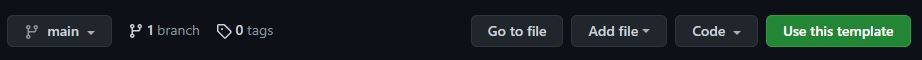
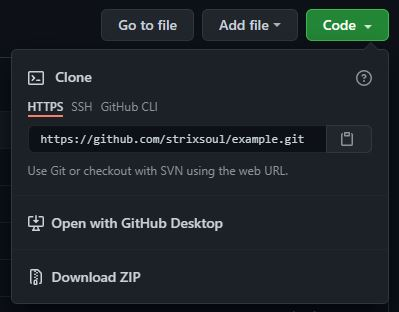

<h1 align="center">Boilerplate de API Node.js e Typescript</h1>

<p align="center">API RESTful utilizada como template para criação de novas API's.</p>
<hr>
<br>

### ✨ Features
- [x] Listar texto de exemplo

<br>

### 📦 Pré-requisitos

- Antes de começar, você vai precisar ter instalado em sua máquina [Node.js](https://nodejs.org/en/) versão >= 12.16.1 e [Yarn](https://yarnpkg.com/) versão >= 1.22.11.

<br>

### 🛠 Tecnologias

As seguintes ferramentas foram usadas na construção do projeto:

- [Node.js](https://nodejs.org/en/)
- [TypeScript](https://www.typescriptlang.org/)
- [Express](https://expressjs.com/pt-br/)
- [Jest](https://jestjs.io/pt-BR//)

<br>

### 🔨 Estrutura

- O projeto segue a arquitetura Domain-Driven Design ou Projeto Orientado a Domínio (DDD) que é um padrão de modelagem orientado a objetos (ou módulos).

<h1>
  
</h1>

- Arquitetura global

```sh
src/
|-- config/ # Contém os arquivos de configuração, exemplo: dotenv, cache e upload
|-- modules/ # Contém os módulos (ou objetos) da aplicação
|-- shared/ # Arquivos compartilhados (globais), exemplo: server, errors e container de injeção de dependência
|-- swagger.json # Apenas a documentação
```

- Arquitetura dos módulos

```sh
{module}/
|-- infra/ # Contém as rotas, controllers e implementações de repositórios
|-- models/ # Contém o modelo (ou estrutura) de dados do módulo
|-- providers/ # Arquivos dos repositórios e providers do módulo para serem "injetados" no container de injeção de dependência
|-- repositories/ # Modelo de dados, DTOs e fakes dos repositórios do módulo
|-- services/ # Serviços ou regra de negócio da aplicação
|-- utils/ # Arquivo com funções/lógicas que são utilizadas em dois ou mais services
```

<br>

### 🎲 Rodando a aplicação

- Usando como template no Github (recomendado): [https://github.com/iClouds-Sistemas-Web/nodejs-typescript-api-boilerplate](https://github.com/iClouds-Sistemas-Web/nodejs-typescript-api-boilerplate):

- Clique no botão em destaque e crie seu repositório:

<h1>
  
</h1>

- Em seguida clone o repositório criado clicando no botão em destaque e copie o comando:

<h1>
  
</h1>


- Iniciando o projeto:

```bash
# Clonando o repositório
$ git clone [comando copiado]

# Acessando o diretório
$ cd [repositório]

# Instalando dependências
$ yarn

# Rodando o servidor
$ yarn dev
```

<br>

- Ou clone o repositório original:
```bash
# Clonando o repositório
$ git clone https://github.com/iClouds-Sistemas-Web/nodejs-typescript-api-boilerplate.git

# Acessando o diretório
$ cd nodejs-typescript-api-boilerplate

# Instalando dependências
$ yarn

# Rodando o servidor
$ yarn dev
```

<br>


- Rodando em produção:

```bash
obs.: copie o arquivo .env.example para um .env

# Gerando build do projeto
$ yarn build

# Executando a build
$ yarn start
```

- Após o fim da execução, a aplicação se encontrará em: [http://localhost:3333/](http://localhost:3333/)

<br>

### 🧪 Testes unitários

```bash
# Rodando os testes
$ yarn test
```

- Acesse a cobertura de testes no navegador: [repositório]/coverage/lcov-report/index.html

<br>

### 💡 Exemplo
- Visualize a rota de exemplo em: [http://localhost:3333/example](http://localhost:3333/example)

<br>

### 🙋 Utilidade

- [Rotas Insomnia](https://drive.google.com/file/d/1xKlCP4dzfBnuOPthN-QrPtg2pDmE6eAB/view?usp=sharing)
- [Documentação (disponível localmente)](http://localhost:3333/)

<br>

---

Feito com muito 💙 e ☕.
